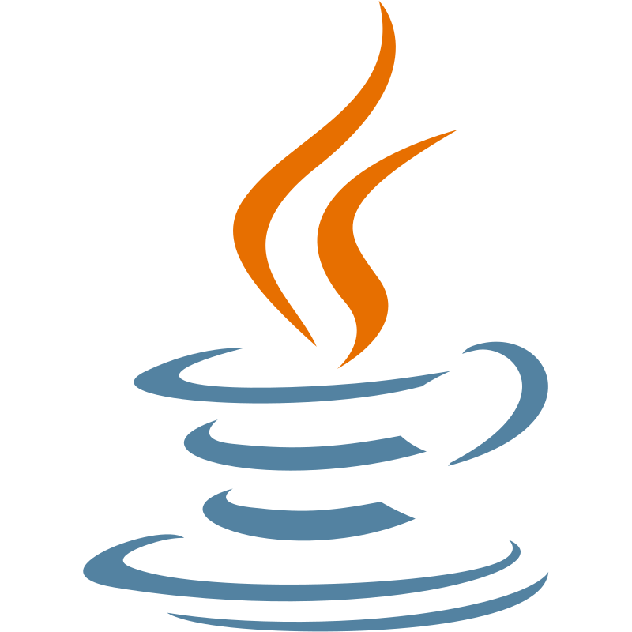
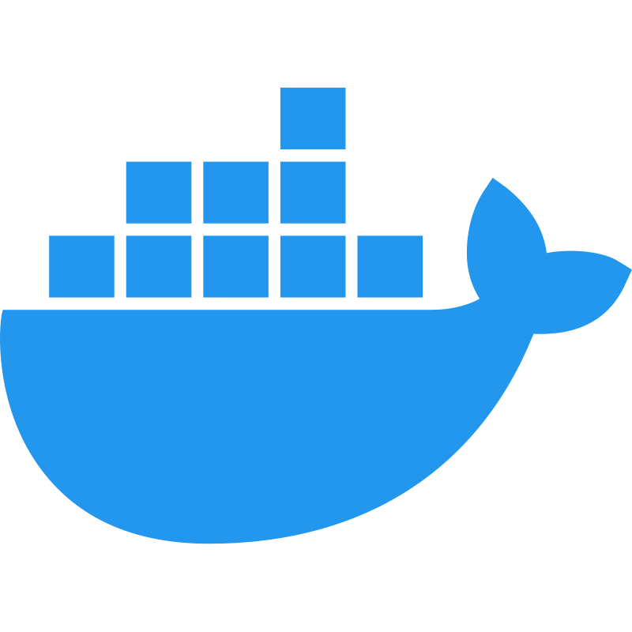
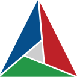
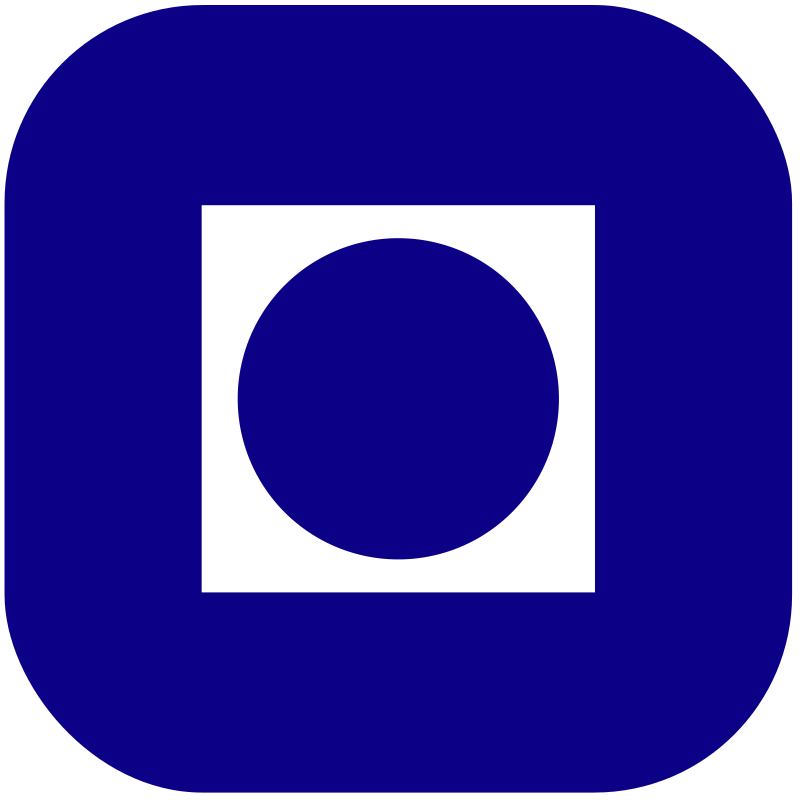

# Hi there, I am Jørgen 


<!-- [](https://www.hackerrank.com/joergen_finsveen) -->


## 🖊️ About Me

I'm a Computer Science student (M.Sc.) at the <a href="https://www.ntnu.edu"> Norwegian University of Science and Technology (NTNU)</a> specializing in **algorithms**, **parallel computing**, **embedded systems**, **low-level programming**, and **computer architecture**.
I'm passionate about building fast, efficient, and reliable systems — both close to the hardware and in scalable software architecture. I don't mind making applications either🤓


## 📫 Contact

📧 _[jorgen.finsveen@ntnu.no](mailto:jorgen.finsveen@ntnu.no)_ &nbsp; &nbsp;

<p>
    <i><a href="https://www.linkedin.com/in/joergen-finsveen/" alt="linkedin-profile">in/jorgen-finsveen</a></i>
</p>

## 🛠️ Technologies and Skills

### Languages

<p>

  &nbsp;
  &nbsp;
  &nbsp;
  &nbsp;
  &nbsp;
  &nbsp;
  &nbsp;
  &nbsp;

</p>

### Frameworks and Tools

<p>

&nbsp;
&nbsp;
&nbsp;
&nbsp;
&nbsp;
&nbsp;

</p>

### High-Performance Computing

&nbsp;
&nbsp;
&nbsp;
&nbsp;

* ```MPI``` &nbsp;&nbsp;&nbsp;&nbsp;&nbsp;&nbsp; __Message Passing Interface__
* ```CUDA``` &nbsp;&nbsp;&nbsp;&nbsp; __GPU Parallelization__
* ```OpenMP``` &nbsp;__Multithreading__
* ```Slurm``` &nbsp;&nbsp; __Linux cluster workload manager__

### Specializations

Parallelization (```MPI```, ```CUDA```, ```OpenMP```), Computer Architecture, Embedded Systems, Algorithms, Systems Programming, Application Development


## 🎓 Education

<br/>
<div display="table" float="left">



__August 2021 - June 2026__ <br/>
__Norwegian University of Science and Technology (<a href="https://www.ntnu.edu">NTNU</a>)__
* __Master's Degree__ - Computer Science
  * _Algorithms and computers_
* __Bachelor's Degree__ - Computer Science
  * _Application development_


</div>


<div display="table" float="left">
&nbsp;&nbsp;

__August 2023 - January 2024__ <br/>
__Technical University of Denmark (<a href="https://www.dtu.dk/english/">DTU</a>)__
* Erasmus+ exchange student

</div>

<br/>

## 📚 Research and Theses &nbsp; [](https://www.ntnu.edu)

- **Master's Thesis (2026)** — *Identifying key performance bottlenecks in mobile GPUs*
  Collaboration with [Arm](https://arm.com).
  Focused on establishing an open, extensible research infrastructure for cycle-level simulation and evaluation of GPU architectures.
- **Bachelor's Thesis (2024)** — *Health Management: Anomaly Detection and Classification*
  Collaboration with [Kongsberg Maritime](https://www.kongsberg.com/maritime/).
  Focused on LSTM-based unsupervised learning models for maritime engine health prediction.
  [Read the thesis here →](https://hdl.handle.net/11250/3138358)

## 📆 Projects and Earlier Work

- [**Silicon**](https://github.com/jorgenfinsveen/silicon) 🚀 — CLI tool for C/C++ project setup, building, and running on macOS Apple Silicon.
- [**JazzQuiz**](https://github.com/KQMATH/moodle-mod_jazzquiz) — Interactive Moodle plugin for gamified quizzes.
- [**QTracker**](https://github.com/KQMATH/moodle-local_qtracker) — Moodle plugin for question tracking and statistics.
- [**STACK**](https://github.com/KQMATH/moodle-qtype_stack) — Advanced question types for mathematics in Moodle.


## 📈 GitHub Stats
<div align="center">
  
  
</div>


<!-- ### 📈 Stats

<br/>

<p float="left">

[](https://github.com/anuraghazra/github-readme-stats)&nbsp;
[](https://git.io/streak-stats)


</p>

<br/><br/> -->
